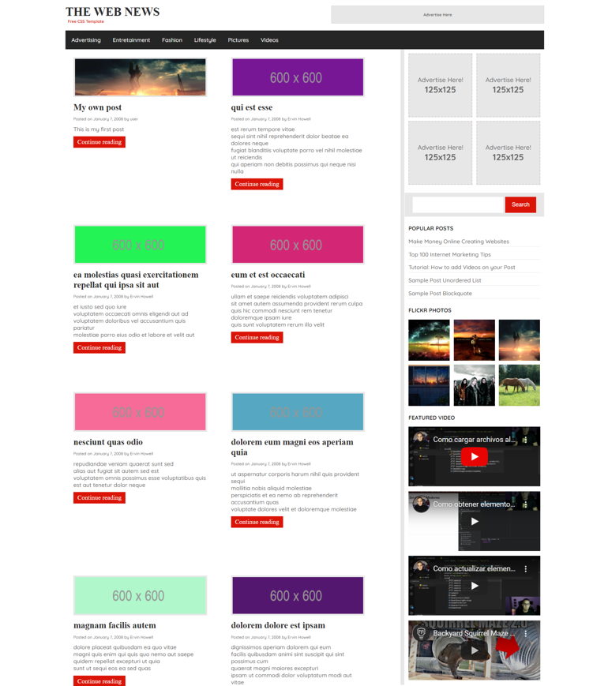
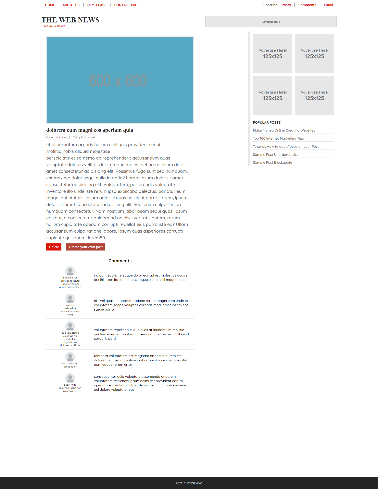

# The-web-news

## ✍🏻 Description

This is part of CSS-HTML-JS challenge to prove my developer skills, a site completely responsive in which y display news and comments from a Fake API

I'm copying this template: https://plantillashtmlgratis.com/wp-content/uploads/2019/images/page107/the-web-news.jpeg

## 🚀 Getting Started

You need download the project and open index.html with a local server. That's all.

## 🎨 Preview

## 👩🏻‍💻 Technologies

1. HTML
2. CSS
3. Vainilla Javascript
